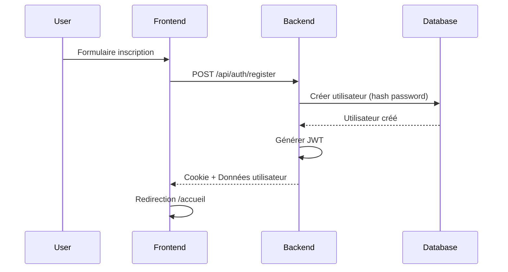
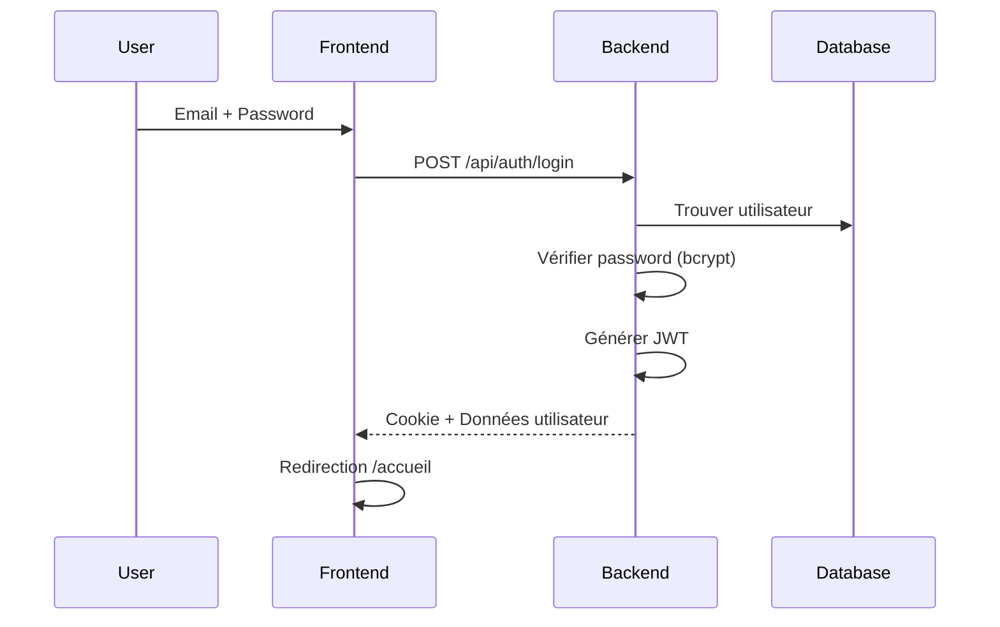
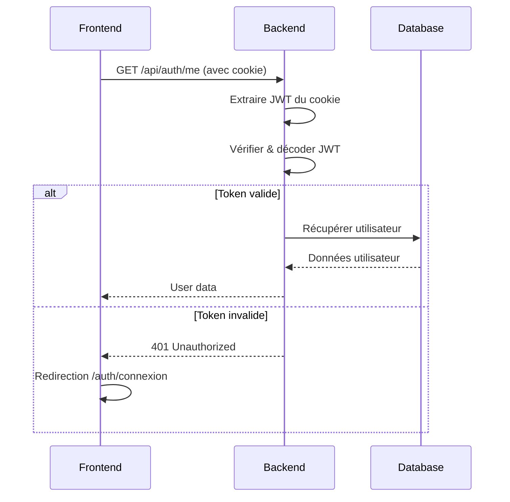
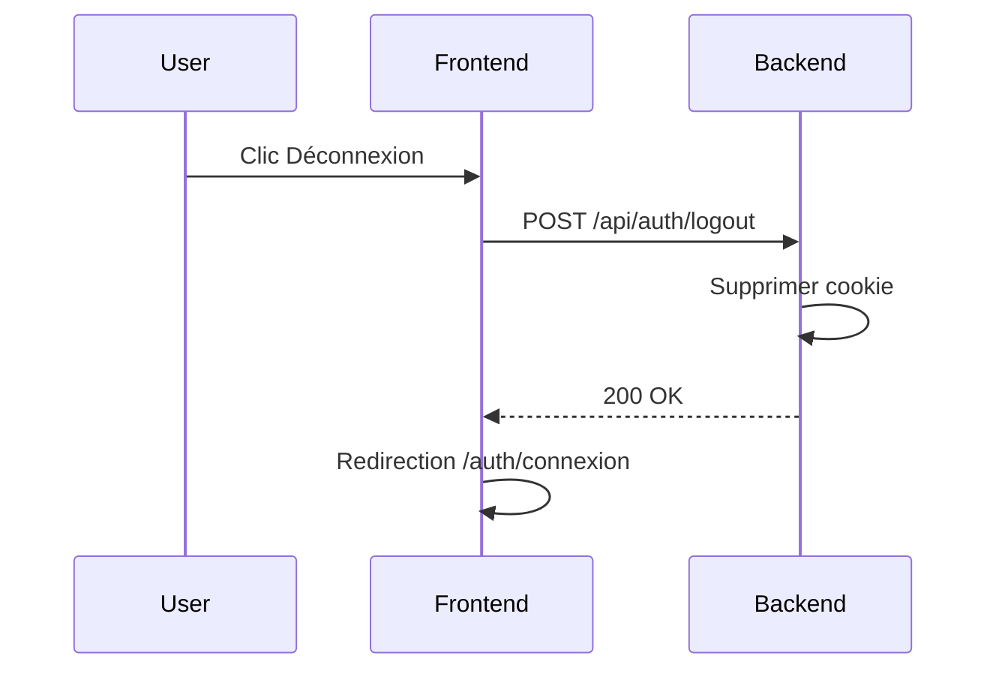

# 🔐 Authentification JWT - Documentation

## 📚 Vue d'ensemble

L'application utilise une authentification **JWT (JSON Web Token)** simple et sécurisée avec des cookies httpOnly.

### Architecture

```
┌─────────────────┐      JWT Cookie      ┌──────────────────┐
│                 │  ────────────────>   │                  │
│   Frontend      │                      │    Backend       │
│   (Nuxt 3)      │  <────────────────   │  (Express + JWT) │
│                 │      User Data       │                  │
└─────────────────┘                      └──────────────────┘
         │                                        │
         │                                        │
         └──────────> HTTP Cookie ────────────────┘
                    (httpOnly, secure)
```

---

## 🔑 Concepts clés

### Token JWT

Un JWT contient 3 parties :
- **Header** : Algorithme de signature (HS256)
- **Payload** : Données utilisateur (userId, email, role)
- **Signature** : Garantit l'intégrité du token

```typescript
// Exemple de payload JWT
{
  userId: "uuid",
  email: "user@example.com",
  role: "ADMIN",
  iat: 1699021200,  // Issued at
  exp: 1699626000   // Expiration (7 jours)
}
```

### Cookies httpOnly

Les tokens JWT sont stockés dans des **cookies httpOnly** :
- ✅ Non accessibles via JavaScript (protection XSS)
- ✅ Envoyés automatiquement avec chaque requête
- ✅ Expiration côté serveur contrôlée
- ✅ Secure en production (HTTPS uniquement)

---

## 🚀 Flux d'authentification

### 1. Inscription (Register)



**Étapes détaillées** :
1. Utilisateur remplit le formulaire (name, email, password)
2. Frontend envoie les données à `/api/auth/register`
3. Backend hash le mot de passe avec bcrypt (10 rounds)
4. Backend crée l'utilisateur dans PostgreSQL
5. Backend génère un JWT signé avec `JWT_SECRET`
6. Backend définit le cookie `auth_token` (httpOnly, 7 jours)
7. Frontend reçoit les données utilisateur
8. Frontend redirige vers `/accueil`

### 2. Connexion (Login)



**Étapes détaillées** :
1. Utilisateur entre email/password
2. Frontend envoie les credentials à `/api/auth/login`
3. Backend recherche l'utilisateur par email
4. Backend compare le password avec `bcrypt.compare()`
5. Si valide, génère un nouveau JWT
6. Backend définit le cookie `auth_token`
7. Frontend redirige vers `/accueil`

### 3. Vérification session



### 4. Déconnexion (Logout)



---

## 📂 Structure du code

### Backend

```
backend/src/
├── config/
│   └── jwt.ts              # Configuration JWT
├── middleware/
│   └── authMiddleware.ts   # Protection routes
├── routes/
│   └── authRoutes.ts       # Endpoints auth
└── server.ts               # cookie-parser
```

### Frontend

```
frontend/
├── pages/
│   ├── index.vue           # Vérification session
│   └── auth/
│       ├── connexion.vue   # Page login
│       └── inscription.vue # Page register
└── nuxt.config.ts          # Configuration cookies
```

---

## 🛠️ Configuration Backend

### 1. Configuration JWT (`/config/jwt.ts`)

```typescript
import jwt from 'jsonwebtoken';

const JWT_SECRET = process.env.JWT_SECRET || 'votre-secret';
const JWT_EXPIRES_IN = '7d';

export interface JWTPayload {
  userId: string;
  email: string;
  role: string;
}

// Générer un token
export const generateToken = (payload: JWTPayload): string => {
  return jwt.sign(payload, JWT_SECRET, {
    expiresIn: JWT_EXPIRES_IN,
  });
};

// Vérifier un token
export const verifyToken = (token: string): JWTPayload | null => {
  try {
    return jwt.verify(token, JWT_SECRET) as JWTPayload;
  } catch {
    return null;
  }
};
```

### 2. Middleware d'authentification (`/middleware/authMiddleware.ts`)

```typescript
import { Request, Response, NextFunction } from 'express';
import { verifyToken } from '../config/jwt';

export const authenticate = (req: Request, res: Response, next: NextFunction) => {
  // Récupérer le token du cookie
  const token = req.cookies?.auth_token;

  if (!token) {
    return res.status(401).json({
      success: false,
      message: 'Non authentifié',
    });
  }

  // Vérifier le token
  const decoded = verifyToken(token);

  if (!decoded) {
    return res.status(401).json({
      success: false,
      message: 'Token invalide',
    });
  }

  // Attacher les données à la requête
  req.user = decoded;
  next();
};

// Middleware pour rôle admin
export const requireAdmin = (req: Request, res: Response, next: NextFunction) => {
  if (req.user?.role !== 'ADMIN') {
    return res.status(403).json({
      success: false,
      message: 'Accès refusé',
    });
  }
  next();
};
```

### 3. Routes d'authentification (`/routes/authRoutes.ts`)

Les routes incluent :
- `POST /api/auth/register` - Inscription
- `POST /api/auth/login` - Connexion
- `POST /api/auth/logout` - Déconnexion
- `GET /api/auth/me` - Données utilisateur connecté

### 4. Configuration serveur (`server.ts`)

```typescript
import cookieParser from 'cookie-parser';

// Middleware cookie-parser
app.use(cookieParser());

// CORS avec credentials
app.use(cors({
  origin: 'http://localhost:3000',
  credentials: true, // IMPORTANT pour les cookies
}));
```

---

## 🎨 Configuration Frontend

### 1. Configuration Nuxt (`nuxt.config.ts`)

```typescript
export default defineNuxtConfig({
  runtimeConfig: {
    public: {
      apiBase: 'http://localhost:3001',
    },
  },
});
```

### 2. Page de connexion

```typescript
// Requête avec credentials: 'include' pour envoyer les cookies
const response = await $fetch(`${config.public.apiBase}/api/auth/login`, {
  method: 'POST',
  credentials: 'include', // ESSENTIEL
  body: {
    email: email.value,
    password: password.value,
  },
});
```

### 3. Vérification de session

```typescript
// Vérifier si l'utilisateur est connecté
const response = await $fetch(`${config.public.apiBase}/api/auth/me`, {
  credentials: 'include',
});
```

---

## 🔒 Sécurité

### Hachage des mots de passe

```typescript
import bcrypt from 'bcryptjs';

// À l'inscription
const hashedPassword = await bcrypt.hash(password, 10);

// À la connexion
const isValid = await bcrypt.compare(password, user.password);
```

**Recommandations** :
- ✅ Minimum 8 caractères
- ✅ Bcrypt avec 10 rounds (bon équilibre sécurité/performance)
- ✅ Ne jamais retourner le hash dans les réponses API

### Configuration des cookies

```typescript
res.cookie('auth_token', token, {
  httpOnly: true,              // Protection XSS
  secure: process.env.NODE_ENV === 'production', // HTTPS en prod
  sameSite: 'lax',            // Protection CSRF
  maxAge: 7 * 24 * 60 * 60 * 1000, // 7 jours
});
```

### JWT Secret

**⚠️ IMPORTANT** : Le `JWT_SECRET` doit être :
- Minimum 32 caractères
- Aléatoire et unique
- Stocké dans `.env` (JAMAIS committé)
- Différent entre dev/staging/prod

```env
# .env
JWT_SECRET=votre-secret-super-long-et-securise-de-32-caracteres-minimum
```

### Protection des routes

```typescript
// Route protégée
router.get('/protected', authenticate, (req, res) => {
  // req.user contient les données du JWT
  res.json({ user: req.user });
});

// Route admin uniquement
router.delete('/users/:id', authenticate, requireAdmin, (req, res) => {
  // Accessible uniquement aux admins
});
```

---

## 📊 Schéma de base de données

### Modèle User (Prisma)

```prisma
model User {
  id            String    @id @default(uuid())
  name          String
  email         String    @unique
  password      String    // Hashé avec bcrypt
  emailVerified Boolean   @default(false)
  image         String?
  role          UserRole  @default(USER)
  isActive      Boolean   @default(true)
  createdAt     DateTime  @default(now())
  updatedAt     DateTime  @updatedAt

  @@map("user")
}

enum UserRole {
  ADMIN
  MANAGER
  USER
}
```

**Note** : Plus besoin des tables Session/Account/Verification de Better Auth !

---

## 🧪 Tests

### Test inscription

```bash
curl -X POST http://localhost:3001/api/auth/register \
  -H "Content-Type: application/json" \
  -d '{
    "name": "Jean Dupont",
    "email": "jean@example.com",
    "password": "password123"
  }'
```

### Test connexion

```bash
curl -X POST http://localhost:3001/api/auth/login \
  -H "Content-Type: application/json" \
  -c cookies.txt \
  -d '{
    "email": "jean@example.com",
    "password": "password123"
  }'
```

### Test vérification session

```bash
curl http://localhost:3001/api/auth/me \
  -b cookies.txt
```

### Test déconnexion

```bash
curl -X POST http://localhost:3001/api/auth/logout \
  -b cookies.txt
```

---

## 🐛 Debugging

### Vérifier les cookies dans le navigateur

1. Ouvrir DevTools (F12)
2. Onglet **Application** > **Cookies**
3. Chercher `auth_token` sur `localhost`
4. Vérifier :
   - ✅ Cookie existe
   - ✅ `HttpOnly` est coché
   - ✅ Date d'expiration dans 7 jours

### Logs backend

```typescript
// Ajouter logs temporaires
console.log('Cookie reçu:', req.cookies);
console.log('Token décodé:', decoded);
console.log('User dans requête:', req.user);
```

### Problèmes courants

**Cookie non envoyé** :
- ✅ Vérifier `credentials: 'include'` dans $fetch
- ✅ Vérifier CORS `credentials: true`
- ✅ Vérifier que origin est exact (pas de slash final)

**Token invalide** :
- ✅ Vérifier `JWT_SECRET` identique
- ✅ Vérifier que le token n'a pas expiré
- ✅ Régénérer le client Prisma après migration

**401 Unauthorized** :
- ✅ Vérifier que le cookie est bien envoyé
- ✅ Vérifier le middleware `authenticate`
- ✅ Logs: `console.log(req.cookies.auth_token)`

---

## 🚀 Migration depuis Better Auth

### Changements effectués

1. ✅ Désinstallé `better-auth`
2. ✅ Installé `jsonwebtoken`, `cookie-parser`
3. ✅ Simplifié le schéma Prisma (supprimé Session, Account, Verification)
4. ✅ Créé système JWT simple
5. ✅ Supprimé toutes les pages OAuth

### Migration base de données

```bash
# Sauvegarder d'abord
pg_dump -U user pointage_db > backup.sql

# Appliquer les changements
npx prisma db push
npx prisma generate
```

### Avantages du JWT simple

- ✅ **Simplicité** : Code maîtrisé et compréhensible
- ✅ **Performance** : Pas de requête DB à chaque vérification
- ✅ **Légèreté** : Moins de dépendances
- ✅ **Flexibilité** : Contrôle total sur le système
- ✅ **Debugging** : Plus facile à débugger

---

## 📚 Ressources

- [JWT.io](https://jwt.io/) - Débugger et décoder des JWT
- [bcrypt](https://www.npmjs.com/package/bcryptjs) - Hachage de mots de passe
- [jsonwebtoken](https://www.npmjs.com/package/jsonwebtoken) - Librairie JWT
- [Express cookie-parser](https://expressjs.com/en/resources/middleware/cookie-parser.html)

---

**Documentation mise à jour** - 04/11/2025
