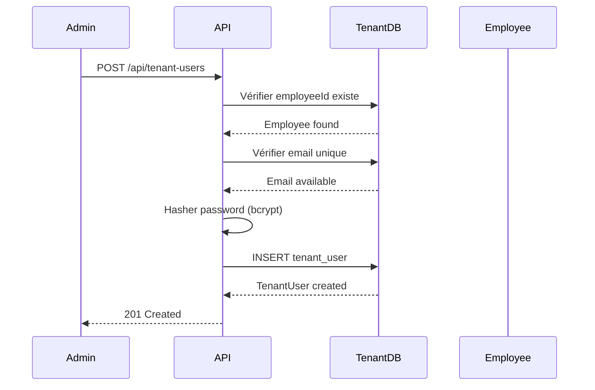
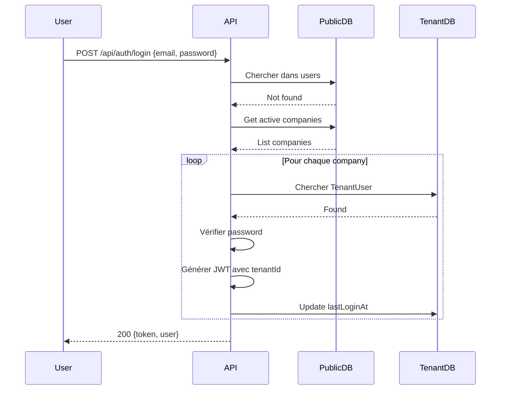
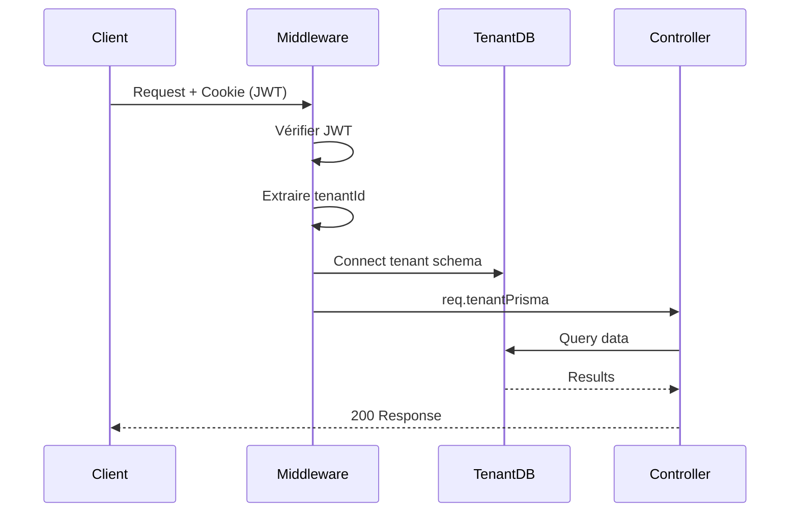

# Système de Gestion des Utilisateurs Tenant (TenantUsers)

## 📋 Table des matières

1. [Vue d'ensemble](#vue-densemble)
2. [Architecture](#architecture)
3. [Modèle de données](#modèle-de-données)
4. [Authentification](#authentification)
5. [Middleware de sécurité](#middleware-de-sécurité)
6. [Routes API](#routes-api)
7. [Permissions](#permissions)
8. [Fichiers concernés](#fichiers-concernés)
9. [Flux de données](#flux-de-données)
10. [Résolution de problèmes](#résolution-de-problèmes)

---

## 🎯 Vue d'ensemble

Le système de **TenantUsers** permet de créer des comptes utilisateurs pour les employés d'une organisation. Ces utilisateurs ont des permissions spécifiques et peuvent accéder à l'application selon leur rôle.

### Types d'utilisateurs

Le système gère **deux types d'utilisateurs** :

1. **Admin/SUPER_ADMIN** : Stockés dans la table `users` du schéma `public`
   - Administrateurs de l'organisation
   - Accès complet à toutes les fonctionnalités
   - Gèrent l'organisation et les employés

2. **TenantUsers** : Stockés dans la table `tenant_users` du schéma tenant
   - Employés avec compte d'accès
   - Permissions personnalisables
   - Rôles : MANAGER, USER, RH

---

## 🏗️ Architecture

### Schéma Multi-Tenant

```
PostgreSQL Database
├── Schema: public
│   ├── Table: users (Admin/SUPER_ADMIN)
│   └── Table: companies (Organisations)
│
└── Schema: <tenant_name> (ex: sirhame_tech)
    ├── Table: employees (Tous les employés)
    ├── Table: tenant_users (Employés avec compte)
    ├── Table: attendances (Pointages)
    └── ...autres tables tenant
```

### Relation Employee ↔ TenantUser

```
┌──────────────────┐         ┌─────────────────────┐
│    employees     │         │    tenant_users     │
├──────────────────┤         ├─────────────────────┤
│ id               │◄────────│ employeeId (FK)     │
│ matricule        │         │ email               │
│ fullName         │         │ password (hashed)   │
│ email            │         │ role                │
│ departmentId     │         │ permissions (JSON)  │
│ positionId       │         │ isBlocked           │
│ isActive         │         │ lastLoginAt         │
└──────────────────┘         └─────────────────────┘
      1                              0..1
```

**Important** : Un employé peut exister sans compte TenantUser (accès physique uniquement). Un TenantUser doit obligatoirement être lié à un employé.

---

## 💾 Modèle de données

### Table `tenant_users` (Schema Tenant)

```sql
CREATE TABLE IF NOT EXISTS "${schemaName}"."tenant_users" (
  "id" TEXT PRIMARY KEY,
  "employeeId" TEXT NOT NULL UNIQUE,
  "email" TEXT NOT NULL UNIQUE,
  "password" TEXT NOT NULL,
  "role" "${schemaName}"."TenantUserRole" NOT NULL DEFAULT 'USER',
  "isBlocked" BOOLEAN NOT NULL DEFAULT false,
  "permissions" JSONB NOT NULL DEFAULT '[]',
  "lastLoginAt" TIMESTAMP(3),
  "createdAt" TIMESTAMP(3) NOT NULL DEFAULT CURRENT_TIMESTAMP,
  "updatedAt" TIMESTAMP(3) NOT NULL,
  CONSTRAINT "tenant_users_employeeId_fkey" 
    FOREIGN KEY ("employeeId") 
    REFERENCES "${schemaName}"."employees"("id") 
    ON DELETE CASCADE ON UPDATE CASCADE
);
```

### ENUM TenantUserRole

```sql
CREATE TYPE "${schemaName}"."TenantUserRole" AS ENUM ('MANAGER', 'USER', 'RH');
```

**Rôles disponibles :**
- **MANAGER** : Gestion d'équipe, accès étendu
- **USER** : Utilisateur standard, accès limité
- **RH** : Ressources Humaines, accès aux employés et historique

### Permissions (JSONB Array)

Les permissions sont stockées en JSON et contrôlent l'accès aux fonctionnalités :

```json
["pointage", "historique", "employees", "parametre", "utilisateur"]
```

**Permissions disponibles :**
- `pointage` : Accès à la page de pointage
- `historique` : Consultation de l'historique
- `employees` : Gestion des employés
- `parametre` : Configuration système
- `utilisateur` : Gestion des utilisateurs tenant

---

## 🔐 Authentification

### JWT Payload

Le système utilise JWT avec des payloads différents selon le type d'utilisateur :

#### Admin User

```typescript
{
  userId: string;
  email: string;
  role: 'ADMIN' | 'SUPER_ADMIN';
  companyId: string;  // ID de l'organisation
}
```

#### TenantUser

```typescript
{
  userId: string;
  email: string;
  role: 'MANAGER' | 'USER' | 'RH';
  tenantId: string;      // schemaName de l'organisation
  employeeId: string;    // ID de l'employé lié
}
```

### Interface JWTPayload (`src/config/jwt.ts`)

```typescript
export interface JWTPayload {
  userId: string;
  email: string;
  role: string;
  companyId?: string;    // Pour Admin
  tenantId?: string;     // Pour TenantUsers
  employeeId?: string;   // Pour TenantUsers
}
```

---

## 🛡️ Middleware de sécurité

### `tenantMiddleware.ts`

Le middleware identifie automatiquement le type d'utilisateur et connecte au bon schéma tenant.

```typescript
// src/middleware/tenantMiddleware.ts

export const identifyTenant = async (req, res, next) => {
  // 1. Récupérer et vérifier le JWT
  const token = req.cookies?.auth_token || req.headers.authorization;
  const decoded = jwt.verify(token, JWT_SECRET);
  
  // 2. Détecter le type d'utilisateur
  if (decoded.tenantId) {
    // TenantUser - Récupérer organisation via schemaName
    company = await prismaPublic.company.findUnique({
      where: { schemaName: decoded.tenantId }
    });
  } else if (decoded.companyId) {
    // Admin - Récupérer organisation via companyId
    company = await prismaPublic.company.findUnique({
      where: { id: decoded.companyId }
    });
  }
  
  // 3. Connecter au schéma tenant
  req.tenantPrisma = getTenantConnection(company.schemaName);
  req.tenantSchema = company.schemaName;
  req.companyId = company.id;
  
  next();
};
```

**Flux du middleware :**
```
Request → Vérifier JWT → Détecter type user → Charger company → Connecter tenant → Next
```

---

## 🚀 Routes API

### POST `/api/auth/login` - Connexion universelle

Route intelligente qui gère automatiquement les deux types d'utilisateurs.

**Fichier** : `src/routes/authRoutes.ts`

```typescript
router.post('/login', async (req, res) => {
  const { email, password } = req.body;
  
  // 1. Chercher dans la table Admin (public.users)
  const adminUser = await prismaPublic.user.findUnique({
    where: { email },
    include: { company: true }
  });
  
  if (adminUser && bcrypt.compareSync(password, adminUser.password)) {
    // Admin trouvé - Générer token avec companyId
    const token = generateToken({
      userId: adminUser.id,
      email: adminUser.email,
      role: adminUser.role,
      companyId: adminUser.companyId
    });
    
    return res.json({ success: true, data: { token, user: adminUser } });
  }
  
  // 2. Chercher dans les TenantUsers de tous les tenants actifs
  const companies = await prismaPublic.company.findMany({
    where: { isActive: true }
  });
  
  for (const company of companies) {
    const tenantPrisma = getTenantConnection(company.schemaName);
    
    const tenantUser = await tenantPrisma.tenantUser.findUnique({
      where: { email },
      include: { employee: { include: { department: true, position: true } } }
    });
    
    if (tenantUser && bcrypt.compareSync(password, tenantUser.password)) {
      // TenantUser trouvé - Générer token avec tenantId
      const token = generateToken({
        userId: tenantUser.id,
        email: tenantUser.email,
        role: tenantUser.role,
        tenantId: company.schemaName,
        employeeId: tenantUser.employeeId
      });
      
      await tenantPrisma.tenantUser.update({
        where: { id: tenantUser.id },
        data: { lastLoginAt: new Date() }
      });
      
      return res.json({
        success: true,
        data: {
          token,
          user: {
            id: tenantUser.id,
            email: tenantUser.email,
            role: tenantUser.role,
            permissions: tenantUser.permissions,
            employee: { /* détails employé */ },
            company: { /* détails organisation */ }
          }
        }
      });
    }
  }
  
  return res.status(401).json({ success: false, message: 'Identifiants incorrects' });
});
```

**Avantages de cette approche :**
- ✅ Une seule route pour tous les types d'utilisateurs
- ✅ Détection automatique du type
- ✅ Simplicité pour le frontend
- ✅ Sécurité maintenue

---

### GET `/api/auth/me` - Profil utilisateur

Route qui retourne les informations selon le type d'utilisateur.

```typescript
router.get('/me', authenticate, async (req, res) => {
  const payload = req.user;
  
  if (payload.tenantId) {
    // TenantUser
    const tenantPrisma = getTenantConnection(payload.tenantId);
    const tenantUser = await tenantPrisma.tenantUser.findUnique({
      where: { id: payload.userId },
      include: { employee: { include: { department: true, position: true } } }
    });
    
    return res.json({
      success: true,
      data: {
        user: {
          id: tenantUser.id,
          email: tenantUser.email,
          role: tenantUser.role,
          permissions: tenantUser.permissions,
          employee: {
            fullName: tenantUser.employee.fullName,
            matricule: tenantUser.employee.matricule,
            department: tenantUser.employee.department.name,
            position: tenantUser.employee.position.name
          }
        }
      }
    });
  } else {
    // Admin User
    const user = await prismaPublic.user.findUnique({
      where: { id: payload.userId },
      include: { company: true }
    });
    
    return res.json({ success: true, data: { user } });
  }
});
```

---

### Routes TenantUser CRUD

**Fichier** : `src/controllers/tenantUserController.ts`

#### GET `/api/tenant-users` - Liste des utilisateurs tenant

```typescript
export const getAllTenantUsers = async (req: Request, res: Response) => {
  const tenantPrisma = req.tenantPrisma;
  
  const users = await tenantPrisma.tenantUser.findMany({
    include: {
      employee: {
        include: {
          department: true,
          position: true
        }
      }
    },
    orderBy: { createdAt: 'desc' }
  });
  
  return res.json({ success: true, data: users });
};
```

#### POST `/api/tenant-users` - Créer un utilisateur tenant

```typescript
export const createTenantUser = async (req: Request, res: Response) => {
  const { employeeId, email, password, role, permissions } = req.body;
  const tenantPrisma = req.tenantPrisma;
  
  // 1. Vérifier que l'employé existe
  const employee = await tenantPrisma.employee.findUnique({
    where: { id: employeeId }
  });
  
  if (!employee) {
    return res.status(404).json({
      success: false,
      message: 'Employé non trouvé'
    });
  }
  
  // 2. Vérifier que l'email est unique
  const existingUser = await tenantPrisma.tenantUser.findUnique({
    where: { email }
  });
  
  if (existingUser) {
    return res.status(400).json({
      success: false,
      message: 'Cet email est déjà utilisé'
    });
  }
  
  // 3. Hasher le mot de passe
  const hashedPassword = await bcrypt.hash(password, 10);
  
  // 4. Créer le TenantUser
  const tenantUser = await tenantPrisma.tenantUser.create({
    data: {
      employeeId,
      email,
      password: hashedPassword,
      role: role || 'USER',
      permissions: permissions || [],
      isBlocked: false
    },
    include: {
      employee: {
        include: {
          department: true,
          position: true
        }
      }
    }
  });
  
  logger.info(`Utilisateur tenant créé: ${email}`);
  
  return res.status(201).json({
    success: true,
    data: tenantUser,
    message: 'Utilisateur créé avec succès'
  });
};
```

#### PUT `/api/tenant-users/:id` - Modifier un utilisateur

```typescript
export const updateTenantUser = async (req: Request, res: Response) => {
  const { id } = req.params;
  const { email, role, permissions, password } = req.body;
  const tenantPrisma = req.tenantPrisma;
  
  const updateData: any = { email, role, permissions };
  
  // Mettre à jour le mot de passe si fourni
  if (password) {
    updateData.password = await bcrypt.hash(password, 10);
  }
  
  const tenantUser = await tenantPrisma.tenantUser.update({
    where: { id },
    data: updateData,
    include: {
      employee: {
        include: {
          department: true,
          position: true
        }
      }
    }
  });
  
  return res.json({
    success: true,
    data: tenantUser,
    message: 'Utilisateur mis à jour'
  });
};
```

#### PUT `/api/tenant-users/:id/toggle-block` - Bloquer/Débloquer

```typescript
export const toggleBlockTenantUser = async (req: Request, res: Response) => {
  const { id } = req.params;
  const tenantPrisma = req.tenantPrisma;
  
  const user = await tenantPrisma.tenantUser.findUnique({ where: { id } });
  
  const updated = await tenantPrisma.tenantUser.update({
    where: { id },
    data: { isBlocked: !user.isBlocked }
  });
  
  return res.json({
    success: true,
    data: updated,
    message: updated.isBlocked ? 'Utilisateur bloqué' : 'Utilisateur débloqué'
  });
};
```

#### DELETE `/api/tenant-users/:id` - Supprimer

```typescript
export const deleteTenantUser = async (req: Request, res: Response) => {
  const { id } = req.params;
  const tenantPrisma = req.tenantPrisma;
  
  await tenantPrisma.tenantUser.delete({ where: { id } });
  
  return res.json({
    success: true,
    message: 'Utilisateur supprimé'
  });
};
```

---

## 📂 Fichiers concernés

### Backend

```
pointage-back/
├── src/
│   ├── config/
│   │   └── jwt.ts                    # Interface JWTPayload étendue
│   │
│   ├── middleware/
│   │   ├── authMiddleware.ts         # Authentification JWT
│   │   └── tenantMiddleware.ts       # Détection tenant (MODIFIÉ)
│   │
│   ├── routes/
│   │   ├── authRoutes.ts             # Login universel (MODIFIÉ)
│   │   └── tenantUserRoutes.ts       # Routes CRUD TenantUsers
│   │
│   ├── controllers/
│   │   └── tenantUserController.ts   # Logique métier TenantUsers
│   │
│   ├── services/
│   │   └── tenantService.ts          # Migration tenant (MODIFIÉ)
│   │
│   └── types/
│       └── index.ts                  # Types TypeScript
│
├── prisma/
│   └── schema.prisma                 # Schéma Prisma (MODIFIÉ)
│
└── doc/
    └── tenant-users-system.md        # Cette documentation
```

---

## 🔄 Flux de données

### 1. Création d'un TenantUser



### 2. Connexion TenantUser



### 3. Requête protégée



---

## 🐛 Résolution de problèmes

### Problème 1 : "Table tenant_users does not exist"

**Cause** : Le schéma tenant a été créé avant l'ajout de la table `tenant_users`.

**Solution** : Recréer le schéma tenant avec le script :

```bash
cd pointage-back
npx ts-node scripts/recreate-tenant-schema.ts <nom_schema>
```

**Exemple** :
```bash
npx ts-node scripts/recreate-tenant-schema.ts sirhame_tech
```

⚠️ **Attention** : Cela supprime toutes les données du schéma !

---

### Problème 2 : "valeur en entrée invalide pour le enum StatutPointage : A_L_HEURE"

**Cause** : L'ENUM `StatutPointage` utilisait `PRESENT` au lieu de `A_L_HEURE`.

**Solution** : Le script `recreate-tenant-schema.ts` corrige ce problème automatiquement.

**Vérification manuelle** :
```sql
-- Se connecter au schéma tenant
SET search_path TO sirhame_tech;

-- Vérifier l'ENUM
SELECT enum_range(NULL::StatutPointage);
-- Doit retourner: {A_L_HEURE,EN_RETARD,ABSENT,INCOMPLET}
```

---

### Problème 3 : "Utilisateur non associé à une organisation" (403)

**Cause** : Le middleware `tenantMiddleware` ne gérait que les Admin avec `companyId`.

**Solution** : Vérifier que le middleware a été mis à jour pour gérer `tenantId`.

**Fichier** : `src/middleware/tenantMiddleware.ts`

```typescript
// ✅ BON - Gère les deux types
if (decoded.tenantId) {
  company = await prismaPublic.company.findUnique({
    where: { schemaName: decoded.tenantId }
  });
} else if (decoded.companyId) {
  company = await prismaPublic.company.findUnique({
    where: { id: decoded.companyId }
  });
}
```

---

### Problème 4 : Login TenantUser ne fonctionne pas

**Checklist de diagnostic** :

1. ✅ Le TenantUser existe dans la base ?
```sql
SET search_path TO sirhame_tech;
SELECT * FROM tenant_users WHERE email = 'user@example.com';
```

2. ✅ Le mot de passe est correct ?
```bash
# Tester le hash bcrypt
node -e "console.log(require('bcryptjs').compareSync('password', '$2a$10$...hash...'))"
```

3. ✅ L'employé lié est actif ?
```sql
SELECT e.isActive FROM employees e
JOIN tenant_users tu ON tu."employeeId" = e.id
WHERE tu.email = 'user@example.com';
```

4. ✅ Le compte n'est pas bloqué ?
```sql
SELECT "isBlocked" FROM tenant_users WHERE email = 'user@example.com';
```

5. ✅ L'organisation est active ?
```sql
-- Dans le schéma public
SELECT "isActive" FROM companies WHERE "schemaName" = 'sirhame_tech';
```

---

### Problème 5 : CORS bloque le header `x-tenant-id`

**Solution** : Vérifier que `x-tenant-id` est dans les headers autorisés.

**Fichier** : `src/server.ts`

```typescript
app.use(cors({
  origin: (origin, callback) => { /* ... */ },
  credentials: true,
  methods: ['GET', 'POST', 'PUT', 'DELETE', 'OPTIONS', 'PATCH'],
  allowedHeaders: ['Content-Type', 'Authorization', 'x-tenant-id'], // ✅
  exposedHeaders: ['Set-Cookie'],
}));
```

---

## 🔒 Sécurité

### Bonnes pratiques implémentées

1. **Mots de passe** :
   - ✅ Hashage avec bcrypt (10 rounds)
   - ✅ Jamais stockés en clair
   - ✅ Jamais retournés dans les réponses API

2. **JWT** :
   - ✅ HttpOnly cookies (protection XSS)
   - ✅ Expiration 7 jours
   - ✅ Secret sécurisé (variable d'environnement)

3. **Permissions** :
   - ✅ Vérification côté serveur
   - ✅ Middleware dédié
   - ✅ Isolation par tenant

4. **Validation** :
   - ✅ Emails uniques
   - ✅ Employés existants
   - ✅ Rôles valides

### Points d'attention

⚠️ **Ne jamais** :
- Exposer les mots de passe hashés
- Utiliser le même JWT secret en production
- Permettre la modification du `employeeId` d'un TenantUser
- Supprimer un employé qui a un TenantUser actif

---

## 📊 Schéma récapitulatif

```
┌─────────────────────────────────────────────────────────────┐
│                    SYSTÈME TENANTUSERS                       │
└─────────────────────────────────────────────────────────────┘

┌──────────────┐         ┌──────────────┐         ┌──────────────┐
│  FRONTEND    │◄───────►│   BACKEND    │◄───────►│  PostgreSQL  │
└──────────────┘         └──────────────┘         └──────────────┘
      │                         │                         │
      │ POST /login             │                         │
      ├────────────────────────►│ 1. Chercher Admin      │
      │                         ├────────────────────────►│ public.users
      │                         │                         │
      │                         │ 2. Chercher TenantUser  │
      │                         ├────────────────────────►│ tenant.tenant_users
      │                         │                         │
      │◄────────────────────────┤ 3. Générer JWT         │
      │ {token, user}           │    avec tenantId       │
      │                         │                         │
      │ GET /api/data           │                         │
      │ Cookie: JWT             │                         │
      ├────────────────────────►│ 4. Middleware          │
      │                         │    identifyTenant      │
      │                         │    → Extraire tenantId │
      │                         │    → Connect schema    │
      │                         │                         │
      │                         │ 5. Query tenant data   │
      │                         ├────────────────────────►│ tenant.data
      │                         │                         │
      │◄────────────────────────┤ 6. Return data         │
      │ {data}                  │                         │
```

---

## ✅ Checklist de mise en place

- [x] Table `tenant_users` dans le schéma tenant
- [x] ENUM `TenantUserRole` créé
- [x] Interface `JWTPayload` étendue
- [x] Route `/api/auth/login` gère les deux types
- [x] Route `/api/auth/me` gère les deux types
- [x] Middleware `tenantMiddleware` mis à jour
- [x] Routes CRUD `/api/tenant-users/*`
- [x] Controller `tenantUserController.ts`
- [x] Header CORS `x-tenant-id` autorisé
- [x] Script de recréation `recreate-tenant-schema.ts`
- [x] Documentation complète

---

## 📝 Changelog

### Version 1.0 (2025-11-10)
- ✨ Implémentation initiale du système TenantUsers
- ✨ Login universel pour Admin et TenantUsers
- ✨ Middleware intelligent de détection de tenant
- ✨ Routes CRUD complètes pour TenantUsers
- ✨ Système de permissions JSON
- 🐛 Correction ENUM `StatutPointage` (PRESENT → A_L_HEURE)
- 🐛 Correction middleware tenant avec `tenantId`
- 📚 Documentation complète

---

## 📞 Support

Pour toute question ou problème :
1. Consulter cette documentation
2. Vérifier les logs du serveur
3. Utiliser les requêtes SQL de diagnostic
4. Contacter l'équipe technique

---

**Dernière mise à jour** : 10 novembre 2025
**Version** : 1.0
**Auteur** : Système Pointage App
