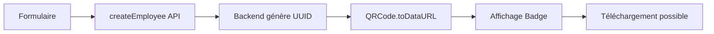
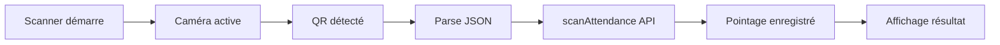
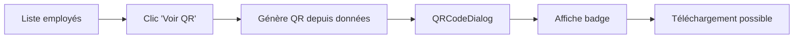

# Documentation d'implémentation du système QR Code

## 📋 Table des matières

1. [Vue d'ensemble](#vue-densemble)
2. [Dépendances](#dépendances)
3. [Architecture des composants](#architecture-des-composants)
4. [Génération de QR Code](#génération-de-qr-code)
5. [Scan de QR Code](#scan-de-qr-code)
6. [Badge Employé](#badge-employé)
7. [Téléchargement de Badge](#téléchargement-de-badge)
8. [Flux de données](#flux-de-données)
9. [Guide d'utilisation](#guide-dutilisation)

---

## 🎯 Vue d'ensemble

Le système QR Code permet de :
- **Générer** des QR codes uniques pour chaque employé
- **Afficher** les QR codes sur des badges personnalisés
- **Scanner** les QR codes pour enregistrer les pointages (entrée/sortie)
- **Télécharger** les badges employés au format image

---

## 📦 Dépendances

### Dépendances principales

```json
{
  "qrcode": "^1.5.4",           // Génération de QR codes
  "html5-qrcode": "^2.3.8",     // Scanner de QR codes
  "html2canvas": "^1.4.1"       // Capture d'écran des badges
}
```

### Dépendances de développement

```json
{
  "@types/qrcode": "^1.5.6",
  "@types/html2canvas": "^1.0.0"
}
```

### Installation

```bash
pnpm add qrcode html5-qrcode html2canvas
pnpm add -D @types/qrcode @types/html2canvas
```

---

## 🏗️ Architecture des composants

### Structure des dossiers

```
frontend/components/
├── qrcode/
│   └── QRCodeDisplay.vue      # Affichage du QR code et téléchargement
├── dialog/
│   └── QRCodeDialog.vue       # Dialog modal pour afficher le badge
├── badge/
│   └── EmployeeBadge.vue      # Badge employé avec QR code
└── scanner/
    └── QrScanner.vue          # Scanner de QR codes
```

---

## 📝 Génération de QR Code

### Composant : `EmployeeBadge.vue`

Badge employé avec photo, informations et QR code intégré.

#### Props

```typescript
interface Props {
  employeeName: string;        // Nom complet de l'employé
  employeePosition: string;    // Poste de l'employé
  employeeMatricule: string;   // Matricule unique
  employeeDepartment: string;  // Département
  qrCodeUrl: string;          // URL du QR code (data URL)
}
```

#### Structure du badge

```vue
<template>
  <div class="employee-badge">
    <!-- Image de fond -->
    <div class="absolute inset-0">
      
    </div>
    
    <!-- Contenu -->
    <div class="relative z-10 bg-white/95 rounded-lg p-8">
      <!-- Titre -->
      <h1>Badge Employé</h1>
      
      <!-- Photo de profil -->
      <div class="profile-icon">
        <Icon icon="mdi:account-circle" />
      </div>
      
      <!-- Informations employé -->
      <h2>{{ employeeName }}</h2>
      <p>{{ employeePosition }}</p>
      <h2 class="text-primary">{{ employeeMatricule }}</h2>
      
      <!-- QR Code (256x256px) -->
      
      
      <!-- Département -->
      <p>{{ employeeDepartment }}</p>
    </div>
  </div>
</template>
```

### Composant : `QRCodeDisplay.vue`

Affiche le badge et permet de le télécharger.

#### Props

```typescript
interface Props {
  qrCode: string;              // URL du QR code
  employeeName: string;        // Nom de l'employé
  employeeMatricule: string;   // Matricule
  employeePosition: string;    // Poste
  employeeDepartment: string;  // Département
}
```

#### Méthodes principales

##### `handleDownload()`

Télécharge le badge complet en image PNG.

```typescript
const handleDownload = async () => {
  if (!badgeRef.value) return;
  
  isDownloading.value = true;
  
  try {
    // 1. Générer un nouveau QR code haute qualité
    const qrData = JSON.stringify({
      name: props.employeeName,
      matricule: props.employeeMatricule,
      position: props.employeePosition,
      department: props.employeeDepartment
    });
    
    // 2. Attendre le rendu complet
    await new Promise(resolve => setTimeout(resolve, 500));
    
    // 3. Capturer le badge avec html2canvas
    const canvas = await html2canvas(badgeRef.value, {
      backgroundColor: '#ffffff',
      scale: 2,                    // Haute résolution
      logging: true,
      useCORS: true,
      allowTaint: false,
      width: 600,
      height: 900,
      windowWidth: 600,
      windowHeight: 900,
      scrollX: 0,
      scrollY: 0,
      foreignObjectRendering: false,
      removeContainer: true,
      onclone: (clonedDoc: Document) => {
        // Styles forcés pour le clone
        const clonedBadge = clonedDoc.querySelector('.employee-badge');
        if (clonedBadge) {
          (clonedBadge as HTMLElement).style.width = '600px';
          (clonedBadge as HTMLElement).style.height = '900px';
        }
      }
    });
    
    // 4. Convertir en blob et télécharger
    canvas.toBlob((blob) => {
      if (blob) {
        const url = URL.createObjectURL(blob);
        const link = document.createElement('a');
        link.download = `Badge_${props.employeeMatricule}_${props.employeeName}.png`;
        link.href = url;
        link.click();
        URL.revokeObjectURL(url);
      }
    }, 'image/png', 1.0);
    
  } catch (error) {
    console.error('Erreur téléchargement:', error);
  } finally {
    isDownloading.value = false;
  }
};
```

**Points clés :**
- ✅ Résolution 2x pour qualité haute définition
- ✅ Dimensions fixes (600x900px) pour cohérence
- ✅ Clone du DOM pour éviter les problèmes de style
- ✅ Format PNG avec qualité maximale

---

## 📱 Génération du QR Code

### Dans `pages/employees/ajouter/index.vue`

Lors de la création d'un employé, un QR code est généré.

```typescript
import QRCode from 'qrcode';

const handleSubmit = async (data: Record<string, any>) => {
  try {
    // 1. Créer l'employé dans la base de données
    const employee = await createEmployee({
      matricule: data.matricule,
      fullName: data.fullName,
      position: data.position,
      department: data.department,
      email: data.email,
      phoneNumber: data.phone,
    });
    
    // 2. Préparer les données pour le QR code
    const qrData = JSON.stringify({
      matricule: employee.matricule,
      fullName: employee.fullName,
      position: employee.position,
      department: employee.department,
      qrCode: employee.qrCode  // UUID unique généré par le backend
    });
    
    // 3. Générer le QR code avec options optimisées
    const qrCodeDataUrl = await QRCode.toDataURL(qrData, {
      width: 512,                    // Taille augmentée pour scan rapide
      margin: 4,                     // Marge importante
      color: {
        dark: '#000000',
        light: '#FFFFFF'
      },
      errorCorrectionLevel: 'H',     // Correction d'erreur maximale (30%)
      type: 'image/png'
    });
    
    generatedQRCode.value = qrCodeDataUrl;
    
  } catch (error) {
    // Gestion d'erreur
  }
};
```

**Options de génération :**
- `width: 512` - Taille augmentée pour meilleure détection
- `margin: 4` - Marge plus importante pour délimitation
- `errorCorrectionLevel: 'H'` - 30% de redondance des données
  - Permet de scanner même si le QR code est partiellement endommagé
  - Augmente la taille mais améliore la fiabilité

**Niveaux de correction d'erreur :**
- `L` (Low) - 7% de récupération
- `M` (Medium) - 15% de récupération
- `Q` (Quartile) - 25% de récupération
- `H` (High) - 30% de récupération ✅ Utilisé

---

## 📸 Scan de QR Code

### Composant : `QrScanner.vue`

Scanner de QR codes utilisant la caméra de l'appareil.

#### Props

```typescript
interface Props {
  type: 'ENTREE' | 'SORTIE';   // Type de pointage
  title: string;                // Titre de la page
  description: string;          // Description
  backRoute?: string;           // Route de retour
}
```

#### Configuration du scanner

```typescript
import { Html5Qrcode, Html5QrcodeScanType } from 'html5-qrcode';

const config = {
  fps: 30,                      // 30 images/seconde pour réactivité
  qrbox: function (viewfinderWidth: number, viewfinderHeight: number) {
    const minEdgePercentage = 0.8;  // Zone de scan = 80% de l'écran
    const minEdgeSize = Math.min(viewfinderWidth, viewfinderHeight);
    const qrboxSize = Math.floor(minEdgeSize * minEdgePercentage);
    return {
      width: qrboxSize,
      height: qrboxSize
    };
  },
  aspectRatio: 1.0,
  disableFlip: false,
  experimentalFeatures: {
    useBarCodeDetectorIfSupported: true  // API native du navigateur
  },
  rememberLastUsedCamera: true,
  supportedScanTypes: [Html5QrcodeScanType.SCAN_TYPE_CAMERA]
};

const cameraConstraints = {
  facingMode: 'environment'     // Caméra arrière
};
```

#### Méthodes principales

##### `startScanning()`

Démarre le scanner de QR codes.

```typescript
const startScanning = async () => {
  try {
    // 1. Demander les permissions caméra
    const hasPermission = await requestCameraPermission();
    if (!hasPermission) return;
    
    isScanning.value = true;
    await nextTick();
    
    // 2. Vérifier que l'élément DOM existe
    const qrReaderElement = document.getElementById('qr-reader');
    if (!qrReaderElement) {
      throw new Error('Élément qr-reader non trouvé');
    }
    
    // 3. Initialiser le scanner
    html5QrCode = new Html5Qrcode('qr-reader');
    
    // 4. Démarrer le scan
    await html5QrCode.start(
      cameraConstraints,
      config,
      onScanSuccess,
      onScanFailure
    );
  } catch (err) {
    console.error('Erreur démarrage scan:', err);
    isScanning.value = false;
  }
};
```

##### `onScanSuccess(decodedText: string)`

Callback appelé lors d'un scan réussi.

```typescript
const onScanSuccess = async (decodedText: string) => {
  // 1. Arrêter le scanner
  await stopScanning();
  
  try {
    // 2. Parser les données du QR code
    const qrData = JSON.parse(decodedText);
    const qrCode = qrData.qrCode;
    
    if (!qrCode) {
      throw new Error('QR code invalide');
    }
    
    // 3. Enregistrer le pointage via l'API
    const { scanAttendance } = await import('~/composables/api/useAttendanceApi')
      .then(m => m.useAttendanceApi());
    
    const attendance = await scanAttendance({
      qrCode: qrCode,
      type: props.type,  // ENTREE ou SORTIE
    });
    
    // 4. Formater et afficher le résultat
    const timestamp = new Date(attendance.timestamp).toLocaleString('fr-FR', {
      day: '2-digit',
      month: '2-digit',
      year: 'numeric',
      hour: '2-digit',
      minute: '2-digit',
      second: '2-digit'
    });
    
    const result: ScanResult = {
      success: true,
      employee: {
        fullName: attendance.employee?.fullName || qrData.fullName,
        matricule: attendance.employee?.matricule || qrData.matricule,
        position: qrData.position,
        department: attendance.employee?.department || qrData.department,
      },
      timestamp
    };
    
    // 5. Afficher le résultat
    localScanResult.value = result;
    emit('scanSuccess', result);
    
    // 6. Toast de succès
    toast.add({
      severity: 'success',
      summary: 'Pointage réussi !',
      detail: `${result.employee?.fullName} - ${props.type}`,
      life: 3000,
    });
    
  } catch (error) {
    // Gestion d'erreur
    console.error('Erreur traitement QR code:', error);
  }
};
```

##### `requestCameraPermission()`

Demande les permissions caméra.

```typescript
const requestCameraPermission = async (): Promise<boolean> => {
  try {
    // Vérifier l'API permissions
    if ('permissions' in navigator) {
      const result = await navigator.permissions.query({ 
        name: 'camera' as PermissionName 
      });
      
      if (result.state === 'denied') {
        toast.add({
          severity: 'error',
          summary: 'Permission refusée',
          detail: 'Activez les permissions dans les paramètres',
          life: 5000,
        });
        return false;
      }
    }
    
    // Demander l'accès
    const stream = await navigator.mediaDevices.getUserMedia({
      video: { facingMode: 'environment' }
    });
    
    // Arrêter le stream
    stream.getTracks().forEach(track => track.stop());
    
    return true;
  } catch (err) {
    console.error('Erreur permission:', err);
    return false;
  }
};
```

---

## 🎫 Badge Employé

### Composant : `QRCodeDialog.vue`

Dialog modal pour afficher et télécharger le badge.

#### Props

```typescript
interface Props {
  visible: boolean;
  qrCode: string;
  employeeName: string;
  employeeMatricule: string;
  employeePosition: string;
  employeeDepartment: string;
}
```

#### Structure

```vue
<template>
  <Dialog
    v-model:visible="dialogVisible"
    modal
    :header="`Badge - ${employeeName}`"
    :style="{ width: '40rem' }"
    :closable="true"
  >
    <!-- Badge complet -->
    <QRCodeDisplay
      :qr-code="qrCode"
      :employee-name="employeeName"
      :employee-matricule="employeeMatricule"
      :employee-position="employeePosition"
      :employee-department="employeeDepartment"
    />
  </Dialog>
</template>
```

---

## 🔄 Flux de données

### 1. Création d'employé



### 2. Scan de QR Code



### 3. Affichage depuis liste



---

## 📖 Guide d'utilisation

### Pour générer un QR code

```vue
<script setup>
import QRCode from 'qrcode';

const generateQR = async (employee) => {
  const qrData = JSON.stringify({
    matricule: employee.matricule,
    fullName: employee.fullName,
    position: employee.position,
    department: employee.department,
    qrCode: employee.qrCode
  });
  
  const qrCodeDataUrl = await QRCode.toDataURL(qrData, {
    width: 512,
    margin: 4,
    errorCorrectionLevel: 'H',
    type: 'image/png'
  });
  
  return qrCodeDataUrl;
};
</script>
```

### Pour afficher un badge

```vue
<template>
  <EmployeeBadge
    employee-name="Jean Dupont"
    employee-matricule="EMP001"
    employee-position="Développeur"
    employee-department="IT"
    :qr-code-url="qrCodeUrl"
  />
</template>
```

### Pour scanner un QR code

```vue
<template>
  <QrScanner
    type="ENTREE"
    title="Pointage Entrée"
    description="Scannez le QR code"
    back-route="/pointage"
    @scan-success="handleScanSuccess"
    @scan-error="handleScanError"
  />
</template>

<script setup>
const handleScanSuccess = (result) => {
  console.log('Pointage réussi:', result.employee);
};

const handleScanError = (error) => {
  console.error('Erreur scan:', error);
};
</script>
```

### Pour télécharger un badge

```vue
<template>
  <QRCodeDisplay
    :qr-code="qrCode"
    :employee-name="employeeName"
    :employee-matricule="matricule"
    :employee-position="position"
    :employee-department="department"
  />
</template>
```

Le bouton de téléchargement est intégré au composant.

---

## 🛠️ Optimisations appliquées

### QR Code

- ✅ Taille 512px pour détection rapide
- ✅ Marge de 4px pour délimitation claire
- ✅ Niveau de correction H (30% de redondance)
- ✅ Format PNG pour qualité maximale

### Scanner

- ✅ FPS à 30 pour réactivité
- ✅ Zone de scan à 80% de l'écran
- ✅ Détecteur natif activé (useBarCodeDetectorIfSupported)
- ✅ Mémorisation de la caméra utilisée

### Badge

- ✅ QR code 256x256px pour bonne visibilité
- ✅ Capture en résolution 2x (1200x1800px)
- ✅ Clone du DOM pour styles corrects
- ✅ Format PNG qualité 1.0

---

## 🔧 Troubleshooting

### Le QR code ne se scanne pas

**Solutions :**
1. Augmenter la taille du QR code (actuellement 256px)
2. Vérifier le niveau de luminosité
3. Maintenir la caméra stable
4. Rapprocher/éloigner le badge de la caméra

### Le badge téléchargé est vide

**Solutions :**
1. Vérifier que les données sont chargées avant la capture
2. Augmenter le délai avant capture (actuellement 500ms)
3. Vérifier les erreurs dans la console

### Permission caméra refusée

**Solutions :**
1. Vérifier les paramètres du navigateur
2. Utiliser HTTPS (obligatoire pour getUserMedia)
3. Réinitialiser les permissions du site

---

## 📞 Support

Pour toute question ou problème :
- Consulter les logs de la console
- Vérifier les permissions caméra
- Tester avec différents navigateurs

---

**Version:** 1.0.0  
**Dernière mise à jour:** 2025-01-05  
**Auteur:** Équipe de développement
